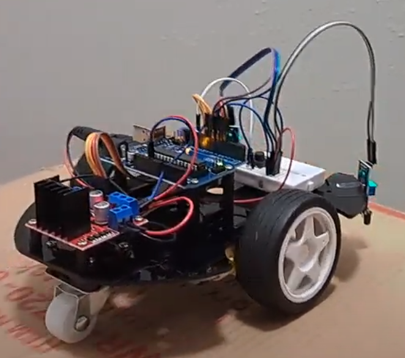

# Wandering Robot
Are you tired of your robot always falling off your desk as it drives on it's merry way? 
Well, I've developed a solution! 
My robot contains two IR sensors that detect when it has reached the edge of the desk or table. When it detected the edge, it will back up and turn, then resume moving forward.

| **Engineer** | **School** | **Area of Interest** | **Grade** |
|:--:|:--:|:--:|:--:|
| Dana S. | UH | Mechanical Engineering | Graduated |


  
# In-Kit Modifications
### Add a Start Button
- Add a push button that will start and stop the robot so it doesn't start moving as soon as you apply power

### Add Bumper Button
- Add a bumper button or buttons that will detect if the robot hits a wall but technically didn't hit the edge of the table

### Add IR Remote Control
- Add IR remote support so you can start and stop the robot remotely

# Out-of-kit Modifications
### Add Back IR Sensor
- Add a third IR sensor on the back of the robot to detect if it is on the corner of the table so it will not back up too far and fall off

### Use more sensitive IR Sensors
- The sensors in the kit required frequent tuning. By purchasing more sensitive IR sensors, this can be avoided

### Add separate battery pack for motors
- The motors draw most of the power from the battery. This can lead the IR sensors to be less accurate when the battery is running low. Adding an additional battery pack devote just to powering the motors should help with this

# Challenges
### Powering the Motors and Sensors via Arduino 
- Had to change the port that connects to motor driver

### Broken Motor Driver
- Kit arrived with ENB jumper cap broken
- Robot goes through 9V batteries very quickly possibly due to the motor driver being internally damaged

### Tuning the IR Sensors
- Making any change to the environment the robot was in (ex. table finish, rounding of table edge) required re-tuning the IR sensors

### Robot Falling Off Table
- Robot would fall off the corner of the tables because the weight was not evenly distributed
- This lead to the leads on one of the IR sensors to get bent

# Second Milestone
Wiring and Programming:
- I completed the wiring by referencing the provided instructions for the SunFounder kit [here](https://docs.sunfounder.com/projects/3in1-kit/en/latest/car_project/car_ir_obstacle.html). I programmed the Arduino by adapting the code provided by SunFounder [here](https://docs.sunfounder.com/projects/3in1-kit/en/latest/download_code.html). The file I modified can be found at the following file location: 3in1-kit-main > car_project > 5.obstacle_avoidance_module > 5.obstacle_avoidance_module.ino
- Modifications: I modified the wiring slightly to utilize a small breadboard. This allowed me to more easily power and ground the components. The original code that was provided was used for obstacles that are in front of the robot. My robot needed to move as long as there WAS an obstacle detected since it was looking for the table below it. I changed the code to invert all of the if statement conditions so it would move forward when an obstacle WAS detected and move backwards when an obstacle was not detected.
- Challenges: Due to the number of sensors and the motor driver needing to be powered, there was not enough space in the screw terminals to fit all of the necessary wires. I fixed this by incorporating the small breadboard. The IR sensors are very sensitive. I fixed this by continuously adjusting the potentiometers on the IR sensors for the different table conditions.
- Future Steps: I plan to further tune my robot for different table conditions and brainstorm additional features and modifications to improve my robot.

# First Milestone
Building the Chassis:
- By following the provided instructions for the SunFounder kit [here](https://docs.sunfounder.com/projects/3in1-kit/en/latest/car_project/car_assemble.html), I built the chassis for my robot. I completed up to step 11 and modified step 12.
- Modified Step 12: Cut two strips of cardboard and tape one end to the backs of the IR sensors. Bend the cardboard to a 90 degree angle and tape the other end to the chassis such that the IR sensors are pointed back towards the table.
- Challenges: The procedure had you put the motors onto the chassis before putting on the stand-offs for the Arduino. This made it difficult to screw in the stand-offs. I would change the procedure to have the stand-offs put on first, then the motors.
- Future Steps: I plan to wire the robot and complete the programming by the next milestone.

# Code
Here's where you'll put your code. The syntax below places it into a block of code. Follow the guide [here]([url](https://www.markdownguide.org/extended-syntax/)) to learn how to customize it to your project needs. 

```Arduino

const int in1 = 5;
const int in2 = 6;
const int in3 = 9;
const int in4 = 10;

const int rightIR = 7;
const int leftIR = 8;

void setup() {
  Serial.begin(9600);

  //motor
  pinMode(in1, OUTPUT);
  pinMode(in2, OUTPUT);
  pinMode(in3, OUTPUT);
  pinMode(in4, OUTPUT);

  //IR obstacle
  pinMode(leftIR, INPUT);
  pinMode(rightIR, INPUT);

}

void loop() {

  int left = digitalRead(leftIR);  // 0: Obstructed   1: Empty
  int right = digitalRead(rightIR);
  int speed = 150;

  // Serial.print("Left: ");
  // Serial.println(left);
  // Serial.print("Right: ");
  // Serial.println(right);

  if (left && !right) {
    backLeft(speed);
  } else if (!left && right) {
    backRight(speed);
  } else if (left && right) {
    moveBackward(speed);
  } else {
    moveForward(speed);
  }
}

void moveForward(int speed) {
  analogWrite(in1, 0);
  analogWrite(in2, speed);
  analogWrite(in3, speed);
  analogWrite(in4, 0);
  //Serial.println("forward");
}

void moveBackward(int speed) {
  analogWrite(in1, speed);
  analogWrite(in2, 0);
  analogWrite(in3, 0);
  analogWrite(in4, speed);
  //Serial.println("backward");
  //delay(100);
}

void backLeft(int speed) {
  analogWrite(in1, speed);
  analogWrite(in2, 0);
  analogWrite(in3, 0);
  analogWrite(in4, 0);
  //Serial.println("back left");
  //delay(100);
}

void backRight(int speed) {
  analogWrite(in1, 0);
  analogWrite(in2, 0);
  analogWrite(in3, 0);
  analogWrite(in4, speed);
  //Serial.println("back right");
  //delay(100);
}

```
